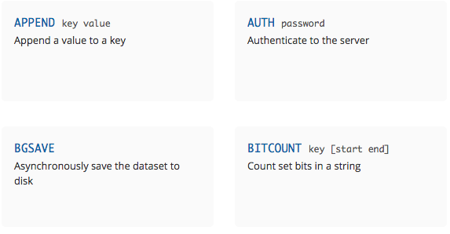
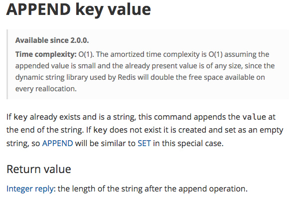

.. ========================================================
.. Redis: persistent collections as a service (and for fun)
.. ========================================================

Redis: persistent collections as a service (and for fun)
--------------------------------------------------------

A quick introduction to Redis, and why I really like it

By Tibs / Tony Ibbs

Presented at PyCon UK 2018

Written using reStructuredText_.

Converted to PDF slides using pandoc_ and beamer_.

Source and extended notes at https://github.com/tibs/redis-talk

.. _reStructuredText: http://docutils.sourceforge.net/docs/ref/rst/restructuredtext.html
.. _pandoc: https://pandoc.org
.. _beamer: https://github.com/josephwright/beamer

----

Summary of what I'd like to cover (not to be included in final slides)
----------------------------------------------------------------------

Broadly: what Redis is, and why it might be useful; the fact it has clients in
many programming languages, and a rather good CLI tool; what datatypes it
provides, and how they relate to Python concepts; that it is instruction
based; how to use the Redis documentation (which is where being instruction
based helps, as one documentation can serve all); how I wanted BRPOPLPUSH, and
was very pleased to discover that (a) it existed, (b) it was atomic, and (c)
that it gives back the data item that it is rotating [if that doesn't make
sense, then I'll be explaining it in the talk!] - this is part of my
assessment that the service is well designed; that several Python clients
exist, but we use redis-py, and how easy it is to use, and also to unit-test
with fakeredis (I consider it very important to show that unit testing is
possible and easy, because we're all used to the hassle of unit testing things
as seemingly simple as Requests).

----

So what is Redis?

-----

Well `its website`_ says:

    Redis is an open source (BSD licensed), in-memory data structure store,
    used as a database, cache and message broker. It supports data structures
    such as strings, hashes, lists, sets, sorted sets with range queries,
    bitmaps, hyperloglogs and geospatial indexes with radius queries. Redis
    has built-in replication, Lua scripting, LRU eviction, transactions and
    different levels of on-disk persistence, and provides high availability
    via Redis Sentinel and automatic partitioning with Redis Cluster.

    -- https://redis.io/

.. _`its website`: https://redis.io/

... and that's not even everything it does!

------------------

I came across it through work, and became enthusiastic about it because:

* it presents an elegant design - it keeps letting me do what I want!
* it has good documentation
* it has excellent Python tooling
* it fill an interesting niche

------------------

My interest is mainly in using the key-value store as a persistence mechanism
for Python.

.. Being a key-value store also puts it in the No-SQL "family"
   (although that's not particularly interesting to me).

------------------

Like the Tardis (!) it can communicate data across time and space:

* across time - a program can save data and re-acquire it later on, in a
  separate run of the process (or after a crash)
* across space - data can be shared across coroutines, threads, processes and
  processors

Also, as in the world of the Tardis, there is no problem of language (on Dr
Who everyone always appears to speak english). There are Redis clients for
many different programming languages, and an excellent command line client.

------------------

This does come at *some* compromise - there are only a limited number of
actual datastructures supported, and their values also have some restrictions.

But as we'll see the common Python datastructures are there, as are some
interesting other cases, and there's always (for instance) JSON.

------------------

So, key-value store::

  <key> : <value>

------

Although:

  Redis is not a plain key-value store, it is actually a data structures
  server, supporting different kinds of values. What this means is that, while
  in traditional key-value stores you associated string keys to string values,
  in Redis the value is not limited to a simple string, but can also hold more
  complex data structures. 

------

Keys
----

Keys are what Redis refers to as *binary safe strings* - in Python we would
call them byte-strings.

The byte-string is actually the basic datatype in Redis.

Note that Redis does not address encodings - that has to be handled
out-of-band, which is (in context) reasonable enough.

(but note redis-py will try to do sensible things)

----

So a Redis key is a byte string, of up to 512MB - although one is discouraged
from using keys that are too big.

1024 bytes is given as an example of too long - perhaps hash it first.

But the documentation advises not to to too short, as well - try to keep
meaning in the key.

.. note:: Interestingly, this *does* mean that one can do things like use a
  JSON datastructure as a key.

----

Traditionally, examples of Redis keys are given in the form
b"<namespace>:<name>" (although they tend to say <server> instead of
<namespace>).

----

So what can values be?
----------------------

This is where it gets interesting:

* binary safe strings (byte strings again)
* lists
* sets
* sorted sets
* hashes
* bit arrays
* hyperloglogs and geospatial values (and so on?)

----

Note: one level only - so a value cannot be a set of hashes.

A reasonable enough restriction. Go with (e.g.) JSON if it's not sufficient.

----

Several of those should be familiar to Python programmers.

NB: Probably sufficient to show the Python examples only, and not the
redis-cli equivalents.

NB: Probably want to talk about what the Python library I'm using does with
respect to being given a string instead of a byte string (but avoid this in
the examples by always using a byte string).

NB: Be prepared to explain why ``StrictRedis`` rather than ``Redis``.

NB: Have a list (just a summary) to hand of all the operations that can be
done on each value type, and on keys.

----

So, let's make a connection to a Redis server:

Command line:

.. code:: sh

  tonibb01@spoon ~/sw$ redis-cli
  127.0.0.1:6379>

----

The Redis command line client is rather nice, and can be very useful for
exploring and testing.

.. image:: images/redis_cli_with_completion.png

NB: explain what the options on that command line mean

----

which as well as completion has nice help

.. image:: images/redis_cli_help.png

----

However, since we're Python programmers, let's use Python:

.. code:: python

  >>> import redis
  >>> r = redis.StrictRedis(host='localhost')

----

Specifically, we're using redis-py_. The Redis web site lists 14 Python
clients (of varying status and type), but for redis-py it says:

  Mature and supported. Currently the way to go for Python. 

We're using the StrictRedis class, which is the norm. There is also a Redis
class, which is backwards compatible with older versions of the library, that
didn't follow the actual Redis commands quite so closely - i.e., some
arguments to methods were in different orders

.. _redis-py: https://github.com/andymccurdy/redis-py

----

String values
-------------

* binary safe strings, just like keys
* can be (e.g.) JSON
* again, encoding is out-of-band information

----

.. code:: sh

  127.0.0.1:6379> set my:string 'some text'
  OK
  127.0.0.1:6379> get my:string
  "some text"

----

.. code:: python

  >>> r.set(b'my:string', b'some text')
  True
  >>> r.get(b'my:string')
  b'some text'

----

But also can treated as integers

(so b'10' represents 10)

Atomic incremenent/decrement

Usable as sempahores

----

.. code:: sh

  127.0.0.1:6379> set my:number 1
  OK
  127.0.0.1:6379> get my:number
  "1"
  127.0.0.1:6379> incr my:number
  (integer) 2
  127.0.0.1:6379> get my:number
  "2"

----

.. code:: python

  >>> r.set(b'my:number', 1)  # NB: 1 -> b'1'
  True
  >>> r.get(b'my:number')
  b'1'
  >>> r.incr(b'my:number')
  2
  >>> r.get(b'my:number')
  b'2'

----

String commands
---------------
Include: APPEND, GET, GETRANGE (get substring), GETSET (set to new value,
return old value), SET, SETNX, SETRANGE, STRLEN

DECR, DECRBY, INCR, INCRBY, INCRBYFLOAT

BITCOUNT, BITFIELD, BITOP, BITPOS, GETBIT, SETBIT

MGET, MSET, MSETNX

----

i.e.,

* get and set
* get length
* append
* get substring, set substring
* set to new value and return old value
* set only if the key does not exist

and:

* increment, decrement
* ditto by other values
* inrement by floating point value

also:

* get multiple values (from their keys)
* set multiple key/value pairs at same time
* ditto only if none of the keys exist

I'll ignore the bit operations

----

Argument encoding in redis-py
-----------------------------

Byte string: nothing to do

For a non-string, convert to a string:

* integer: call ``str`` on it, and encode the result as latin-1
* float: call ``repr`` on it, and encode the result as latin-1
* otherwise, call ``str`` on it

String: default to encoding as utf-8, with strict encoder errors.

So, in general, use ``b"..."`` if you can, but otherwise the library should do
something sensible.

----

List values
-----------

Very much like Python lists, but also like deques.

Can access the last element with index -1.

----

.. code:: sh

  127.0.0.1:6379> lpush my:list 1 2 3
  (integer) 3
  127.0.0.1:6379> lrange my:list 0 -1
  1) "3"
  2) "2"
  3) "1"
  127.0.0.1:6379> rpop my:list
  "1"
  127.0.0.1:6379> lrange my:list 0 -1
  1) "3"
  2) "2"

----

.. code:: python

  >>> r.lpush(b'my:list', 1, 2, 3)
  3
  >>> r.lrange(b'my:list', 0, -1)
  [b'3', b'2', b'1']
  >>> r.rpop(b'my:list')
  b'1'
  >>> r.lrange(b'my:list', 0, -1)
  [b'3', b'2']

----

List commands: LINDEX (get element by index),
LINSERT, LLEN, LPOP, LPUSH, LPUSHX (prepend value, only if list exists),
LRANGE (get range of elements), LREM (remove elements), LSET, LTRIM (trim list
to specific length), RPOP, RPOPLPUSH, RPUSH, RPUSHX

Blocking: BLPOP, BRPOP, BRPOPLPUSH,

----

i.e.

* push new element on either end,
* same but only if the list actually exists (is non-empty),
* pop element from either end,
* blocking versions of same,
* get element by index,
* set element by index,
* get length of list,
* insert element before or after a particular value,
* remove N elements with a given value,
* trim list to specific range of indices,
* rotate element (RPOPLPUSH)
* blocking version of same

----

Is this where I should introduce BRPOPLPUSH, and explain why I like it?

::

  brpoplpush(src, dst, timeout=0)
      Pop a value off the tail of ``src``, push it on the
      head of ``dst`` and then return it.

      This command blocks until a value is in ``src`` or
      until ``timeout`` seconds elapse, whichever is first.
      A ``timeout`` value of 0 blocks forever.

----

.. code:: python

  >>> r.lpush('my:deque', 1, 2, 3, 4, 5)
  5
  >>> r.lrange(b'my:deque', 0, -1)
  [b'5', b'4', b'3', b'2', b'1']
  >>> r.brpoplpush(b'my:deque', b'my:deque')
  b'1'

Note how it returns the value that was rotated.

.. code:: python

  >>> r.lrange(b'my:deque', 0, -1)
  [b'1', b'5', b'4', b'3', b'2']

And of course I can use it to move the value from one list to another.

----

Set values
----------

Again, very like Python sets

----

.. code:: sh

  127.0.0.1:6379> sadd my:set a b c
  (integer) 3
  127.0.0.1:6379> smembers my:set
  1) "a"
  2) "c"
  3) "b"

----

.. code:: python

  >>> r.sadd(b'my:set', 'a', 'b', 'c')
  3
  >>> r.smembers(b'my:set')
  {b'a', b'c', b'b'}

----

Set commands:  SADD, SCARD ("cardinality" = size), SDIFF (subtract sets),
SDIFFSTORE (SDIFF and store the result), SINTER (intersect sets), SINTERSTORE,
SISMEMBER,

----

i.e.,

* add an element
* get the size of the set
* subtract sets
* same and store the result
* intersect sets
* same and store the result
* is a value a member?

... maybe should show an example of storing a result?

----

Sorted set values
-----------------

::

  <key> : <value> and <score>

Done by adding a *score* (a floating point number) to each element.

Set is ordered by that score.

Altough scores do not *need* to be unique.

Can extract by value, by score, by range of scores (including positive and
negative infinity).

----

.. code:: sh

  127.0.0.1:6379> zadd my:zset 0 a
  (integer) 1
  127.0.0.1:6379> zadd my:zset 1 b
  (integer) 1
  127.0.0.1:6379> zrange my:zset 0 -1
  1) "a"
  2) "b"
  127.0.0.1:6379> zrange my:zset 1 -1 withscores
  1) "b"
  2) "1"

----

.. code:: python

  >>> r.zadd(b'my:zset', 0, 'a')
  1
  >>> r.zadd(b'my:zset', 1, 'b')
  1
  >>> r.zrange(b'my:zset', 0, -1)
  [b'a', b'b']
  >>> r.zrange(b'my:zset', 1, -1, withscores=True)
  [(b'b', 1.0)]

----

Sorted set commands:  ZADD, ZCARD, ZCOUNT (count members
with a given score), ZINCRBY (incremement score of a member), ZINTERSTORE,
ZLEXCOUNT, ZPOPMAX (remove and return members with the highest scores),
ZPOPMIN, ZRANGE, ZRANGEBYLEX, ZREVRANGEBYLEX, ZRANGEBYSCORE, ZRANK, ZREM,
ZREMRANGEBYLEX, ZREMRANGEBYRANK, ZREMRANGEBYSCORE, ZREVRANGE,
ZREVRANGEBYSCORE, ZREVRANK, ZSCORE, ZUNIONSTORE, ZSCAN

Blocking: BZPOPMIN, BZPOPMAX

----

i.e.,

* add a score and value
* get the size of the set
* count members with a given score
* increment/decrement the score of a member
* all sorts of other operations...

----

Hash values
-----------

Hashes - just like Python dictionaries, although the hash keys (fields) and
values have to be binary strings.

NB: It's possible to increment and decrement hash values.

::

  <key> : <field> : <value>

----

.. code:: sh

  27.0.0.1:6379> hset my:dict k1 val1
  (integer) 1
  127.0.0.1:6379> hset my:dict k2 val2
  (integer) 1
  127.0.0.1:6379> hget my:dict k2
  "val2"
  127.0.0.1:6379> hkeys my:dict
  1) "k1"
  2) "k2"
  127.0.0.1:6379> hgetall my:dict
  1) "k1"
  2) "val1"
  3) "k2"
  4) "val2"

----

.. code:: python

  >>> r.hset(b'my:dict', b'k1', b'val1')
  1
  >>> r.hset(b'my:dict', b'k2', b'val2')
  1
  >>> r.hget(b'my:dict', b'k2')
  b'val2'
  >>> r.hget(b'my:dict', b'k3')     # i.e., result is None
  >>>
  >>> r.hkeys(b'my:dict')
  [b'k1', b'k2']
  >>> r.hgetall(b'my:dict')
  {b'k1': b'val1', b'k2': b'val2'}

----

Hash value commands: HDEL, HEXISTS (does a field exist), HGET, HGETALL
(Python ``items()``), HINCRBY, HINCRBYFLOAT, HKEYS, HLEN, HMGET (get values
for multiple keys), HMSET, HSET, HSETNX, HSTRLEN, HVALS, HSCAN

----

i.e.,

* set a hash field's value
* set a hash field's value iff it does not exist
* get a hash field's value
* delete one or more hash fields
* does a given hash field exist?
* get all the hash fields and their values
* get all the hash fields
* get all the values
* get the number of hash fields
* get or set multiple hash fields at the same time
* get the length of a hash field's value
* iterate over hash fields and their values

Also, increment and decrement a hash field (as for a plain value)

----

Note: In general, it is possible to delete things whether they exist or not:

.. code:: python

  >>> r.delete(b'my:dict')
  1                               # It existed
  >>> r.exists(b'my:dict')
  False                           # It no longer exists
  >>> r.delete(b'no:such:thing')
  0                               # We deleted a non-existant thing
  >>> r.exists(b'no:such:thing')
  False                           # Which still doesn't exist

----

Other sorts of value
--------------------

Bit arrays: a nice specialisation of strings to give bitmaps, with useful
operations on them. Counted as string operations (in the same way that
incrementing/decrementing is counted as working on strings).

Geo-spatial items: items on a sphere representing the earth.

Hyperloglogs: if you know what they are, you probably like having them.

----

Commands on keys
----------------
Include:

DEL (delete), DUMP (serialised version of its value), EXISTS, EXPIRE (set its
TTL), KEYS (find all keys matching a pattern), MIGRATE (from one Redis
instance to another), MOVE (to a different database), RENAME, RENAMENX (rename
only if the new key does not exist), RESTORE (from a DUMP), SORT (the elements
in a list, set or sorted set), TOUCH, TTL (get its TTL), TYPE (determine the
type stored at that key), SCAN (iterate over keys)

----

i.e., general top-level commands:

* delete one or more keys
* rename a key, and rename only if the new name doesn't exist
* dump its value, serialised, and restore from same
* check if one or more keys exist
* find all keys matching a particular (glob-style) pattern
* report what type is stored at a key
* set or get its TTL
* migrate from one Redis instance to another
* move to a different database
* sort (the elements of a list, set or sorted set) and return or store the
  result
* iterate over keys
* return a random key
* change the last access time of a key ("touch")

----

...at this point introduce the CLI?

.. image:: images/redis_cli_with_completion.png

Those options mean:

* EX seconds -- Set the specified expire time, in seconds.
* PX milliseconds -- Set the specified expire time, in milliseconds.
* NX -- Only set the key if it does not already exist.
* XX -- Only set the key if it already exist.

This means that the SET command can also be used instead of the SETNX, SETEX
and PSETEX commands.

----

which as well as completion has nice help

.. image:: images/redis_cli_help.png

----

.. image:: images/redis_cli_help_for_hashes.png

(obviously more not shown)

----

I do have a grumble about the Python version of the PING command.

Redis says:

  Returns PONG if no argument is provided, otherwise return a copy of the
  argument as a bulk. This command is often used to test if a connection is
  still alive, or to measure latency.

for instance:

.. code:: sh

  redis> PING
  "PONG"
  redis> PING "hello world"
  "hello world"

but for some reason the Python API doesn't work that way:

.. code:: python

  >>> r.ping()
  True
  >>> r.ping('Hello world')
  Traceback (most recent call last):
    File "<stdin>", line 1, in <module>
  TypeError: ping() takes 1 positional argument but 2 were given

(and yes, I really am having to look at the "ping" command in order to find
something to grumble about. However, I did waste some time diagnosing this!)

----

...and the online documentation?

Is generally excellent.

It's mostly organised as articles introducing useful parts of Redis, and
specific pages for each of the individual commands.

The introductory tutorial `Introduction to Redis data types`_ is rather good.

.. _`Introduction to Redis data types`: https://redis.io/topics/data-types-intro

----

Commands overview

This is laid out rather nicely, and you can select to show just the commands
for a particular type of value or other topic ("Filter by group").

-----

Individual command documentation

These generally show:

* the details of the particular command
* some examples
* some common patterns of usage, and advise on when to use them
* links to related commands

On the whole, the documentation at this level is excellent.

The redis-py library is mostly designed so that this documentation can be
directly used in Python code.

-----

.. image:: images/redis_client_by_language.png

----

Unit Testing
------------

Because we use redis-py, we use fakeredis for unit testing

https://github.com/jamesls/fakeredis

    fakeredis is a pure python implementation of the redis-py python client
    that simulates talking to a redis server. This was created for a single
    purpose: to write unittests.

----

.. code:: python

  def test_my_understanding_of_zadd():
      r = fakeredis.FakeStrictRedis(singleton=False)

      now_timestamp = datetime(2018, 4, 23, 0, 0, 0).now()

      r.zadd(b'timeout', now_timestamp, b'text')

      assert r.zrange(b'timeout', 0, -1, withscores=True) \
          == [(b'text', now_timestamp)]

----

.. note:: If ``singleton`` is True, then this FakeStrictRedis instance will
  share its state with other instances (which had ``singleton`` True). I find
  that's not normally what I want in unit tests, where I don't want state to
  carry over between tests.

----

For asyncio, I've been experimenting with aioredis_

.. _aioredis: https://github.com/aio-libs/aioredis

which provides an API very like redis-py, but asyncio

----

For unit-testing *that*, I've found it simplest to just make a very simple
asyncio wrapper class around fakeredis.

This is the approach that mockaioredis_ takes with the mock-redis_ library
and (a) it's really not much work, and (b) it's very simple

(of course, aioredis itself just wraps redis-py!)

.. _mockaioredis: https://github.com/kblin/mockaioredis
.. _mock-redis: https://github.com/locationlabs/mockredis

And pytest-asyncio_ is very nice.

.. _pytest-asyncio: https://github.com/pytest-dev/pytest-asyncio

----

.. code:: python

    class JustEnoughAsyncRedis:

        def __init__(self, fake_redis=None, singleton=False):
            if fake_redis:
                self.redis = fake_redis
            else:
                self.redis = fakeredis.FakeStrictRedis(
                    singleton=singleton)

        async def brpoplpush(self, sourcekey, destkey,
                             timeout=0, encoding=_NOTSET):
            return self.redis.brpoplpush(sourcekey, destkey,
                                         timeout)

        # and so on (only *with* docstrings!)

----

.. note:: The class can be given an existing FakeStrictRedis instance, or
   create its own.

   It can be useful to use an existing instance when one wants to populate or
   retrieve keys in the instance without using the asynchronous interface.

   (is that worth saying? is it worth the bother in an example? should I
   just remove that capability for simplicity?)

----

The asyncio version of our earlier test is very similar

.. code:: python

  @pytest.mark.asyncio
  def test_my_understanding_of_zadd(event_loop):
      ar = JustEnoughAsyncRedis()

      now_timestamp = datetime(2018, 4, 23, 0, 0, 0).now()

      await ar.zadd(b'timeout', now_timestamp, b'text')

      assert await ar.zrange(b'timeout',
                             0, -1, withscores=True) \
          == [(b'text', now_timestamp)]

----

Fin
---

Written using reStructuredText_.

Converted to PDF slides using pandoc_ and beamer_.

Source and extended notes at https://github.com/tibs/redis-talk

.. vim: set filetype=rst tabstop=8 softtabstop=2 shiftwidth=2 expandtab:
