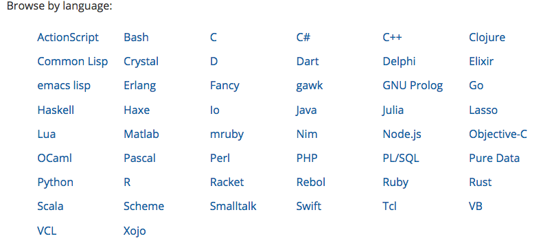

.. ========================================================
.. Redis: persistent collections as a service (and for fun)
.. ========================================================

Redis: persistent collections as a service (and for fun)
--------------------------------------------------------

A quick introduction to Redis, and why I really like it

By Tibs / Tony Ibbs

Presented at PyCon UK 2018

Written using reStructuredText_.

Converted to PDF slides using pandoc_ and beamer_.

Source and extended notes at https://github.com/tibs/redis-talk

.. _reStructuredText: http://docutils.sourceforge.net/docs/ref/rst/restructuredtext.html
.. _pandoc: https://pandoc.org
.. _beamer: https://github.com/josephwright/beamer

----

Summary of what I'd like to cover (from my proposal)
----------------------------------------------------

Broadly: what Redis is, and why it might be useful; the fact it has clients in
many programming languages, and a rather good CLI tool; what datatypes it
provides, and how they relate to Python concepts; that it is instruction
based; how to use the Redis documentation (which is where being instruction
based helps, as one documentation can serve all); how I wanted BRPOPLPUSH, and
was very pleased to discover that (a) it existed, (b) it was atomic, and (c)
that it gives back the data item that it is rotating [if that doesn't make
sense, then I'll be explaining it in the talk!] - this is part of my
assessment that the service is well designed; that several Python clients
exist, but we use redis-py, and how easy it is to use, and also to unit-test
with fakeredis (I consider it very important to show that unit testing is
possible and easy, because we're all used to the hassle of unit testing things
as seemingly simple as Requests).

.. In the notes for the markup-history slides, I separated the text for each
.. slide out onto a separate page (and mentioned that in the README). I'm not
.. 100% sure that actually helped me navigate the notes - it certainly took
.. up more paper - so let's try *not* doing that, with the appropriate runes
.. commented out here, just in case I change my mind.
..
.. If I *do* change my mind, I need to change the slide delimiter (``----``)
.. for the LaTeX rawpage directive.
.. 
.. .. raw:: latex
.. 
..    \newpage

----

So what is Redis?
-----------------

      Redis is an open source (BSD licensed), in-memory data structure store,
      used as a database, cache and message broker. It supports data structures
      such as strings, hashes, lists, sets, sorted sets with range queries,
      bitmaps, hyperloglogs and geospatial indexes with radius queries. Redis
      has built-in replication, Lua scripting, LRU eviction, transactions and
      different levels of on-disk persistence, and provides high availability
      via Redis Sentinel and automatic partitioning with Redis Cluster.

      --- https://redis.io/

... and that's not even everything it does!

----

I came across it through work, and became enthusiastic about it because:

* it presents an elegant design - it keeps letting me do what I want!
* it has good documentation
* it has excellent Python tooling
* it fill an interesting niche

My interest is mainly in using the key-value store as a persistence mechanism
for Python.

Being a key-value store also puts it in the No-SQL "family" (not that that's
particularly interesting to me).

Although, as the Redis documentation says:

  Redis is not a plain key-value store, it is actually a data structures
  server, supporting different kinds of values. What this means is that, while
  in traditional key-value stores you associated string keys to string values,
  in Redis the value is not limited to a simple string, but can also hold more
  complex data structures. 

This does come at *some* compromise - there are only a limited number of
actual datastructures supported, and their values also have some restrictions.

But as we'll see the common Python datastructures are there, as are some
interesting other cases, and there's always (for instance) JSON.

Like the Tardis (!) Redis can communicate data across time and space:

  * across time - a program can save data and re-acquire it later on, in a
    separate run of the process (or after a crash)

  * across space - data can be shared across coroutines, threads, processes and
    processors

    (and, in fact, keys can be migrated between Redis servers as well)

  Also, as in the world of the Tardis, there is no problem of language (on Dr
  Who everyone always appears to speak english). There are Redis clients for
  many different programming languages, and an excellent command line client.

----

Connecting to a server using the command line
---------------------------------------------

  So, let's make a connection to a Redis server:

  .. code:: sh

    tonibb01@spoon ~/sw$ redis-cli
    127.0.0.1:6379>

The Redis command line client is actually rather nice, and available on all
the obvious operating systems.

----

Command line client: completion
-------------------------------

  The Redis command line client is rather nice, and can be very useful for
  exploring and testing.

  .. image:: images/redis_cli_with_completion.png

Here, I've typed the ``set`` and the CLI is prompting me with how to fill out
the rest of the command. This is Really Nice.

It's probably not worth mentioning unless asked, but those options mean:

* ``EX seconds`` -- Set the specified expire time, in seconds.
* ``PX milliseconds`` -- Set the specified expire time, in milliseconds.
* ``NX`` -- Only set the key if it does not already exist.
* ``XX`` -- Only set the key if it already exist.

This means that the ``SET`` command can also be used instead of the ``SETNX``,
``SETEX`` and ``PSETEX`` commands.

----

Command line client: help
-------------------------

  It also has nice help

  .. image:: images/redis_cli_help_for_hashes.png

----

Once more, with Python
----------------------

  However, since we're Python programmers, let's use Python:

  .. code:: python

    >>> import redis
    >>> r = redis.StrictRedis(host='localhost')

The  `Redis clients`_ page list clients in 50 different programming languages
or environments

and 14 individual links for Python. We're using redis-py_. The Redis web site
says redis-py_ is:

  Mature and supported. Currently the way to go for Python. 

We're using the ``StrictRedis`` class, which is the norm. There is also a Redis
class, which is backwards compatible with older versions of the library, that
didn't follow the actual Redis commands quite so closely - i.e., some
arguments to methods were in different orders

.. _redis-py: https://github.com/andymccurdy/redis-py

.. _`Redis clients`: https://redis.io/clients

------

Keys
----

  Keys are what Redis refers to as *binary safe strings* - in Python we would
  call them byte-strings.

  The byte-string is actually the basic datatype in Redis.

  Redis does not address encodings - that has to be handled out-of-band, which
  is (in context) reasonable enough.

  (but redis-py will try to do sensible things)

  Traditionally, examples of Redis keys look like ``b"<namespace>:<name>"``
  (although they tend to say ``<server>`` instead of ``<namespace>``).

So a Redis key is a byte string, of up to 512MB - although one is discouraged
from using keys that are too big.

1024 bytes is given as an example of too long - perhaps hash it first.

But the documentation advises not to to too short, as well - try to keep
meaning in the key.

Interestingly, this *does* mean that one can do things like use a JSON
datastructure as a key.

Traditionally, examples of Redis keys are given in the form
b"<namespace>:<name>" (although they tend to say <server> instead of
<namespace>).

----

Keys: example
-------------

  .. code:: python

    >>> r.set(b'my:key', 'value')
    True                            # OK
    >>> r.delete(b'my:key')
    1                               # The key existed
    >>> r.exists(b'my:key')
    False                           # It's gone now
    >>> r.delete(b'no:such:thing')
    0                               # The key didn't exist
    >>> r.exists(b'no:such:thing')
    False                           # It's still gone

Note that that's two different keys - the first exists, the second never
did.

Other interesting key commands include:

* ``DUMP``, ``RESTORE`` - dump its value (as a string), and restore therefrom
* ``KEYS`` - find all keys matching a particular (glob-style) pattern
* ``MIGRATE`` - migrate from one Redis instance to another
* ``MOVE`` - move to a different database
* ``RANDOMKEY`` - return a random key
* ``RENAME``, ``RENAMENX`` - rename a key, and rename only if the new name doesn't exist
* ``SCAN`` iterate over keys
* ``SORT`` - sort (the elements of a list, set or sorted set) and return or store the
* ``TYPE`` - report what type is stored at a key
* Various commands to set the TTL for a key

----

What can values be?
-------------------

  * binary safe strings (byte strings again)
  * lists
  * sets
  * sorted sets
  * hashes
  * bit arrays (bitmaps)
  * geospatial values
  * hyperloglogs

This is where it gets interesting.

Several of those should be familiar to Python programmers.

Foreshadowing: since a binary safe string can be quite large, it's reasonable
to store (for instance) JSON, which allows a lot more variety.

Is it worth looking for commonalities in:

* which operations provide blocking alternatives
* which operations provide ``X`` (only if it exists) and ``NX`` (only if it
  doesn't exist) variants
* which operations provide what sort of increment, and whether decrement is
  implicit/explicit (is decrement always available?) and whether floating
  point increment is always an alternative.
* other commonalities?

----

String values
-------------

  * binary safe strings, just like keys
  * can be (e.g.) JSON
  * again, encoding is out-of-band information

  .. code:: python

    >>> r.set(b'my:string', b'some text')
    True
    >>> r.get(b'my:string')
    b'some text'
    >>> r.strlen(b'my:string')
    9
    >>> r.getrange(b'my:string', 5, -1)
    b'text'

Other interesting string value commands include:

* ``APPEND`` - append
* ``SETRANGE`` - set substring
* ``GETSET`` - set to new value and return old value
* ``SETNX`` - set only if the key does not exist

also:

* ``MGET`` - get multiple values (from their keys)
* ``MSET`` - set multiple key/value pairs at same time
* ``MSETNX`` - ditto only if none of the keys exist

----

String values as numbers
------------------------

  .. code:: python

    >>> r.set(b'my:number', 1)  # NB: 1 -> b'1'
    True
    >>> r.get(b'my:number')
    b'1'
    >>> r.incr(b'my:number')
    2
    >>> r.get(b'my:number')
    b'2'

  So that gives us counters, and also semaphores.

That's atomic increment and decrement.

Other interesting string-value-as-number commands include:

* ``INCRBY``, ``DECRBY`` - increment/decrement by other values
* ``INCRBYFLOAT`` - increment by floating point value

Note that there's no need for ``DECRBYFLOAT`` as the value given to
``INCRBYFLOAT`` can be negative.

(The bitmap operations also count as string operations, but I shall ignore
them for this talk.)

----

So how does redis-py handle arguments?
--------------------------------------

  - Byte string: nothing to do

  - For a non-string, first convert to a string:

    * integer: call ``str`` on it, and encode the result as latin-1
    * float: call ``repr`` on it, and encode the result as latin-1
    * otherwise, call ``str`` on it

  - String: default to encoding as utf-8, with strict encoder errors.

  So, in general, use ``b"..."`` if you can, but otherwise the library should do
  something sensible.

----

List values
-----------

  .. code:: python

          >>> r.lpush(b'my:list', 3, 2, 1)
          3
          >>> r.rpush(b'my:list', 4)
          4
          >>> r.lrange(b'my:list', 0, -1)
          [b'1', b'2', b'3', b'4']
          >>> r.lpop(b'my:list')
          b'1'
          >>> r.rpop(b'my:list')
          b'4'
          >>> r.lrange(b'my:list', 0, -1)
          [b'2', b'3']

Very much like Python lists, but also like deques.

Can access the last element with index -1.

Other interesting list value commands include:

* ``LSET``, ``LINDEX`` - set and get by index
* ``LPUSHX``, ``RPUSHX`` - only push if the list exists
* ``LLEN`` - get length of list,
* ``LINSERT`` - insert element before or after a particular value,
* ``LREM`` - remove N elements with a given value,
* ``LTRIM`` - trim list to specific range of indices,

and blocking variants:

* ``BLPOP``, ``BRPOP`` - blocking ``POP``

----

My favourite Redis instruction
------------------------------

  ::

    brpoplpush(src, dst, timeout=0)
        Pop a value off the tail of ``src``, push it on the
        head of ``dst`` and then return it.

        This command blocks until a value is in ``src`` or
        until ``timeout`` seconds elapse, whichever is first.
        A ``timeout`` value of 0 blocks forever.

So this is the blocking version of ``RPOPLPUSH`` - Right Pop Left Push.

``RPOPLPUSH``: Remove the last element in a list, prepend it to another list,
and return it. The documentation says (in part):

    Atomically returns and removes the last element (tail) of the list stored
    at source, and pushes the element at the first element (head) of the list
    stored at destination.

    If source does not exist, the value nil is returned and no operation is
    performed. If source and destination are the same, the operation is
    equivalent to removing the last element from the list and pushing it as
    first element of the list, so it can be considered as a list rotation
    command.

``BRPOPLPUSH`` further says:

    When source is empty, Redis will block the connection until another client
    pushes to it or until timeout is reached. A timeout of zero can be used to
    block indefinitely.

It returns a null reply (None in Python) if the operation times out.

The patterns given in the documentation are "Reliable queue" and "Circular
list"

----

BRPOPLPUSH example
------------------

  .. code:: python

    >>> r.lpush('my:deque', 1, 2, 3, 4, 5)
    5
    >>> r.lrange(b'my:deque', 0, -1)
    [b'5', b'4', b'3', b'2', b'1']
    >>> r.brpoplpush(b'my:deque', b'my:deque')
    b'1'

  Note how it returns the value that was rotated.

  .. code:: python

    >>> r.lrange(b'my:deque', 0, -1)
    [b'1', b'5', b'4', b'3', b'2']

And of course I can use it to move the value from one list to another.

----

Set values
----------

  .. code:: python

          >>> r.sadd(b'my:set1', 'a', 'b', 'c')
          3
          >>> r.sadd(b'my:set2', 'x', 'b', 'z')
          3
          >>> r.sdiff(b'my:set1', b'my:set2')
          {b'c', b'a'}
          >>> r.sinterstore(b'my:set3', b'my:set1', b'my:set2')
          1
          >>> r.smembers(b'my:set3')
          {b'b'}

Again, very like Python sets

Other interesting set value commands:

* ``SUNION``, ``SUNIONSTORE`` - get/store the union of the given sets
* ``SCARD`` - get the size of the set
* ``SREM`` - remove one or more members
* ``SISMEMBER`` - is a value a member?
* ``SMOVE`` - move a member from one set to another
* ``SPOP`` - remove and return one or more random members
* ``SRANDMEMBER`` - get one or more random members
* ``SSCAN`` - iterate set value members

----

Sorted set values
-----------------

  ::

      <key> : <value> and <score>

  * Done by adding a *score* (a floating point number) to each element.
  * Scores do not *need* to be unique.
  * Set is ordered by that score.

  Can extract by value, by score, by range of scores (including positive and
  negative infinity).

----

Sorted set values example
-------------------------

    .. code:: python

      >>> r.zadd(b'my:zset', 0, 'a')
      1
      >>> r.zadd(b'my:zset', 1, 'b')
      1
      >>> r.zrange(b'my:zset', 0, -1)
      [b'a', b'b']
      >>> r.zrange(b'my:zset', 1, -1, withscores=True)
      [(b'b', 1.0)]

Other interesting sorted set commands include:

* ``ZCOUNT`` - count members with a given score
* ``ZINCRBY`` - increment the score of a member
* ``ZPOPMIN``, ``ZPOPMAX`` - pop the members with lowest/highest scores
* ``BZPOPMIN``, ``BZPOPMAX`` - blocking equivalents of those

and equivalents of the ordinary set commands.

Note that the ``zrange`` method maps to two Redis commands, ``ZRANGE`` and
``ZRANGEBYSCORE``.

----

Hash values
-----------

  ::

    <key> : <field> : <value>

  Just like the top-level ``<key> : <value>``.

  This is as far down as it goes though.

Hashes - just like Python dictionaries, although the hash keys (fields) and
values have to be binary strings.

NB: It's possible to increment and decrement hash values.

----

Hash values example
-------------------

  .. code:: python

    >>> r.hset(b'my:dict', b'k1', b'val1')
    1
    >>> r.hset(b'my:dict', b'k2', b'val2')
    1
    >>> r.hget(b'my:dict', b'k2')
    b'val2'
    >>> r.hget(b'my:dict', b'k3')
    >>> # i.e., result is None
    >>>
    >>> r.hkeys(b'my:dict')
    [b'k1', b'k2']
    >>> r.hgetall(b'my:dict')
    {b'k1': b'val1', b'k2': b'val2'}

----

Other interesting hash value commands

* ``HSETNX`` - set a hash field's value iff it does not exist
* ``HDEL`` - delete one or more hash fields
* ``HEXISTS`` - does a given hash field exist?
* ``HKEYS`` - get all the hash fields
* ``HVALS`` - get all the values
* ``HLEN`` - get the number of fields in a hash
* ``HMGET``, ``HMSET`` - get or set multiple hash fields at the same time
* ``HSTRLEN`` - get the length of a hash field's value
* ``HSCAN`` - iterate over hash fields and their values
* ``HINCRBY`` - increment a hash field

Other sorts of value
~~~~~~~~~~~~~~~~~~~~

(which I may or may not mention - they were in the list near the start of the
slideset)

Bit arrays: a nice specialisation of strings to give bitmaps, with useful
operations on them. Counted as string operations (in the same way that
incrementing/decrementing is counted as working on strings).

Geo-spatial items: items on a sphere representing the earth.

Hyperloglogs: if you know what they are, you probably like having them.

My one grumble about redis-py
-----------------------------

  Redis says ``PING``:

    Returns PONG if no argument is provided, otherwise return a copy of the
    argument as a bulk.

  .. code:: sh

    redis> PING
    "PONG"
    redis> PING "hello world"
    "hello world"

  but redis-py doesn't work that way:

  .. code:: python

    >>> r.ping()
    True
    >>> r.ping('Hello world')
    Traceback (most recent call last):
      File "<stdin>", line 1, in <module>
    TypeError: ping() takes 1 positional argument but 2 were given

(and yes, I really am having to look at the "ping" command in order to find
something to grumble about. However, I did waste some time diagnosing this!)

----

The online documentation
------------------------

  Is generally excellent.

  It's mostly organised as articles introducing useful parts of Redis, and
  specific pages for each of the individual commands.

  The introductory tutorial `Introduction to Redis data types`_ is rather good.

.. _`Introduction to Redis data types`: https://redis.io/topics/data-types-intro

----

Commands overview
-----------------

  .. image:: images/redis_webpage_commands_smaller.png

  This is laid out rather nicely, and you can select to show just the commands
  for a particular type of value or other topic ("Filter by group").

-----

Individual command documentation
--------------------------------

  .. image:: images/redis_webpage_command_append_smaller.png

These generally show:

* the details of the particular command
* some examples
* some common patterns of usage, and advise on when to use them
* links to related commands

On the whole, the documentation at this level is excellent.

The redis-py library is mostly designed so that this documentation can be
directly used in Python code.

----

Unit Testing
------------

  .. code:: python

    from fakeredis import FakeStrictRedis

    def test_my_understanding_of_zadd():
        r = FakeStrictRedis(singleton=False)

        now_timestamp = datetime(2018, 4, 23, 0, 0, 0).now()

        r.zadd(b'timeout', now_timestamp, b'text')

        assert r.zrange(b'timeout', 0, -1, withscores=True) \
            == [(b'text', now_timestamp)]

Because we use redis-py, we use fakeredis for unit testing

https://github.com/jamesls/fakeredis

    fakeredis is a pure python implementation of the redis-py python client
    that simulates talking to a redis server. This was created for a single
    purpose: to write unittests.

NB: In the call of ``FakeStrictRedis``, if ``singleton`` is True, then this
``FakeStrictRedis`` instance will share its state with other instances (which
had ``singleton`` True). I find that's not normally what I want in unit tests,
where I don't want state to carry over between tests.

----

Asyncio Redis
-------------

  | For asyncio, I've been experimenting with aioredis_
  | which provides an API very like redis-py, but with ``await`` in appropriate places.

.. _aioredis: https://github.com/aio-libs/aioredis

----

Asyncio Redis example
---------------------

  .. code:: python

          import asyncio
          import aioredis

          async def set_key():
              redis = await aioredis.create_redis(
                  'redis://localhost', loop=loop)
              await redis.set('my:key', 'value')
              val = await redis.get('my:key')
              print(val)
              redis.close()
              await redis.wait_closed()

          loop = asyncio.get_event_loop()
          loop.run_until_complete(set_key())

----

Async unit testing - wrap FakeRedis
-----------------------------------

  .. code:: python

      from fakeredis import FakeStrictRedis
      from aioredis.util import _NOTSET

      class JustEnoughAsyncRedis:

          def __init__(self):
              self.redis = FakeStrictRedis(singleton=False)

          async def brpoplpush(self, sourcekey, destkey,
                               timeout=0, encoding=_NOTSET):
              return self.redis.brpoplpush(sourcekey, destkey,
                                           timeout)

          # and so on (only *with* docstrings, please!)

For unit-testing aioredis, I've found it simplest to just make a very simple
asyncio wrapper class around fakeredis.

This is the approach that mockaioredis_ takes with the mock-redis_ library
and (a) it's really not much work, and (b) it's very simple

(of course, aioredis itself just wraps redis-py!)

.. _mockaioredis: https://github.com/kblin/mockaioredis
.. _mock-redis: https://github.com/locationlabs/mockredis

----

  The asyncio version of our earlier test is very similar

  .. code:: python

    @pytest.mark.asyncio
    async def test_my_understanding_of_zadd(event_loop):
        ar = JustEnoughAsyncRedis()

        now_timestamp = datetime(2018, 4, 23, 0, 0, 0).now()

        await ar.zadd(b'timeout', now_timestamp, b'text')

        assert await ar.zrange(b'timeout',
                               0, -1, withscores=True) \
            == [(b'text', now_timestamp)]

We're using our fake aioredis class.

And pytest-asyncio_ is very nice - that gives us the ``@pytest.mark.asyncio``
decorator, to make our test asynchronous, and the ``event_loop``, which is
an asyncio event loop just for this test.

.. _pytest-asyncio: https://github.com/pytest-dev/pytest-asyncio

----

Other cool things
-----------------

  * Redis server is single-threaded, which makes atomicity feasible
  * Pub/sub (broadcast) messaging
  * Transactions
  * Programmable in Lua
  * Command protocol is documented
  * Geospatial values
  * Streams

*This slide is optional. Only use it if there's time!*

* Redis server is single-threaded, which makes atomicity feasible
* Pub/sub (broadcast) messaging
* Transactions
* Programmable in Lua

  And the documentation for this doesn't assume you know Lua, which is nice.

* Command protocol is documented

  So, for instance, you can do bulk uploading by creating your own command
  stream and piping it through redis-cli.

* Geospatial values

  I've not used them, but they look cool.

* Streams

  New in Redis 5.0. "models a log data structure in a more abstract way".

  Producer adds entries to a stream, and consumer can query it in various
  useful ways. Appears to be primarily aimed at logging management.

----

And that's all, folks.

.. vim: set filetype=rst tabstop=8 softtabstop=2 shiftwidth=2 expandtab:
