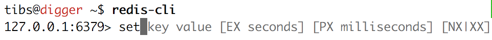
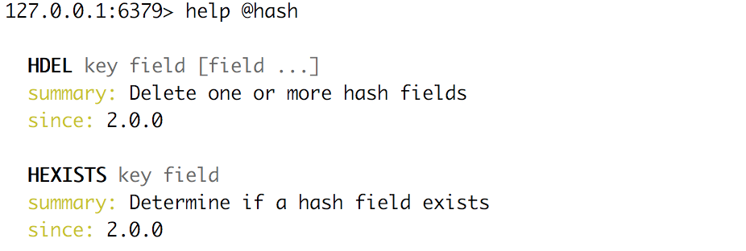
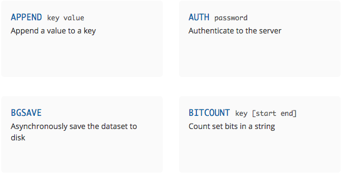
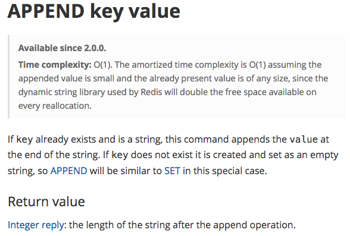

.. ========================================================
.. Redis: persistent collections as a service (and for fun)
.. ========================================================

Redis: persistent collections as a service (and for fun)
--------------------------------------------------------

A quick introduction to Redis, and why I really like it

By Tibs / Tony Ibbs

Presented at PyCon UK 2018

Written using reStructuredText_.

Converted to PDF slides using pandoc_ and beamer_.

Source and extended notes at https://github.com/tibs/redis-talk

.. _reStructuredText: http://docutils.sourceforge.net/docs/ref/rst/restructuredtext.html
.. _pandoc: https://pandoc.org
.. _beamer: https://github.com/josephwright/beamer

----

So what is Redis?
-----------------

    Redis is an open source (BSD licensed), in-memory data structure store,
    used as a database, cache and message broker. It supports data structures
    such as strings, hashes, lists, sets, sorted sets with range queries,
    bitmaps, hyperloglogs and geospatial indexes with radius queries. Redis
    has built-in replication, Lua scripting, LRU eviction, transactions and
    different levels of on-disk persistence, and provides high availability
    via Redis Sentinel and automatic partitioning with Redis Cluster.

    --- https://redis.io/

----
Connecting to a server using the command line
---------------------------------------------

So, let's make a connection to a Redis server:

.. code:: sh

  tonibb01@spoon ~/sw$ redis-cli
  127.0.0.1:6379>

----

Command line client: completion
-------------------------------

The Redis command line client is rather nice, and can be very useful for
exploring and testing.

----

Command line client: help
-------------------------

It also has nice help

----

Once more, with Python
----------------------

However, since we're Python programmers, let's use Python:

.. code:: python

  >>> import redis
  >>> r = redis.StrictRedis(host='localhost')

------

Keys
----
Keys are what Redis refers to as *binary safe strings* - in Python we would
call them byte-strings.

The byte-string is actually the basic datatype in Redis.

Redis does not address encodings - that has to be handled out-of-band, which
is (in context) reasonable enough.

(but redis-py will try to do sensible things)

Traditionally, examples of Redis keys look like ``b"<namespace>:<name>"``
(although they tend to say ``<server>`` instead of ``<namespace>``).

----

Keys: example
-------------

.. code:: python

  >>> r.set(b'my:key', 'value')
  True                            # OK
  >>> r.delete(b'my:key')
  1                               # The key existed
  >>> r.exists(b'my:key')
  False                           # It's gone now
  >>> r.delete(b'no:such:thing')
  0                               # The key didn't exist
  >>> r.exists(b'no:such:thing')
  False                           # It's still gone

----

What can can values be?
-----------------------

* binary safe strings (byte strings again)
* lists
* sets
* sorted sets
* hashes
* bit arrays (bitmaps)
* geospatial values
* hyperloglogs

----

String values
-------------

* binary safe strings, just like keys
* can be (e.g.) JSON
* again, encoding is out-of-band information

.. code:: python

  >>> r.set(b'my:string', b'some text')
  True
  >>> r.get(b'my:string')
  b'some text'
  >>> r.strlen(b'my:string')
  9
  >>> r.getrange(b'my:string', 5, -1)
  b'text'

----

String values as numbers
------------------------

.. code:: python

  >>> r.set(b'my:number', 1)  # NB: 1 -> b'1'
  True
  >>> r.get(b'my:number')
  b'1'
  >>> r.incr(b'my:number')
  2
  >>> r.get(b'my:number')
  b'2'

So that gives us counters, and also sempahores.

----

So how does redis-py handle arguments?
--------------------------------------

- Byte string: nothing to do

- For a non-string, first convert to a string:

  * integer: call ``str`` on it, and encode the result as latin-1
  * float: call ``repr`` on it, and encode the result as latin-1
  * otherwise, call ``str`` on it

- String: default to encoding as utf-8, with strict encoder errors.

So, in general, use ``b"..."`` if you can, but otherwise the library should do
something sensible.

----

List values
-----------

.. code:: python

        >>> r.lpush(b'my:list', 3, 2, 1)
        3
        >>> r.rpush(b'my:list', 4)
        4
        >>> r.lrange(b'my:list', 0, -1)
        [b'1', b'2', b'3', b'4']
        >>> r.lpop(b'my:list')
        b'1'
        >>> r.rpop(b'my:list')
        b'4'
        >>> r.lrange(b'my:list', 0, -1)
        [b'2', b'3']

----

My favourite Redis instruction
------------------------------

::

  brpoplpush(src, dst, timeout=0)
      Pop a value off the tail of ``src``, push it on the
      head of ``dst`` and then return it.

      This command blocks until a value is in ``src`` or
      until ``timeout`` seconds elapse, whichever is first.
      A ``timeout`` value of 0 blocks forever.

----

BRPOPLPUSH example
------------------

.. code:: python

  >>> r.lpush('my:deque', 1, 2, 3, 4, 5)
  5
  >>> r.lrange(b'my:deque', 0, -1)
  [b'5', b'4', b'3', b'2', b'1']
  >>> r.brpoplpush(b'my:deque', b'my:deque')
  b'1'

Note how it returns the value that was rotated.

.. code:: python

  >>> r.lrange(b'my:deque', 0, -1)
  [b'1', b'5', b'4', b'3', b'2']

----

Set values
----------

.. code:: python

        >>> r.sadd(b'my:set1', 'a', 'b', 'c')
        3
        >>> r.sadd(b'my:set2', 'x', 'b', 'z')
        3
        >>> r.sdiff(b'my:set1', b'my:set2')
        {b'c', b'a'}
        >>> r.sinterstore(b'my:set3', b'my:set1', b'my:set2')
        1
        >>> r.smembers(b'my:set3')
        {b'b'}

----

Sorted set values
-----------------

::

  <key> : <value> and <score>

* Done by adding a *score* (a floating point number) to each element.
* Scores do not *need* to be unique.
* Set is ordered by that score.

Can extract by value, by score, by range of scores (including positive and
negative infinity).

----

Sorted set values example
-------------------------

.. code:: python

  >>> r.zadd(b'my:zset', 0, 'a')
  1
  >>> r.zadd(b'my:zset', 1, 'b')
  1
  >>> r.zrange(b'my:zset', 0, -1)
  [b'a', b'b']
  >>> r.zrange(b'my:zset', 1, -1, withscores=True)
  [(b'b', 1.0)]

----

Hash values
-----------

::

  <key> : <field> : <value>

Just like the top-level ``<key> : <value>``.

This is as far down as it goes though.

----

Hash values example
-------------------

.. code:: python

  >>> r.hset(b'my:dict', b'k1', b'val1')
  1
  >>> r.hset(b'my:dict', b'k2', b'val2')
  1
  >>> r.hget(b'my:dict', b'k2')
  b'val2'
  >>> r.hget(b'my:dict', b'k3')
  >>> # i.e., result is None
  >>>
  >>> r.hkeys(b'my:dict')
  [b'k1', b'k2']
  >>> r.hgetall(b'my:dict')
  {b'k1': b'val1', b'k2': b'val2'}

----

My one grumble about redis-py
-----------------------------

Redis says ``PING``:

  Returns PONG if no argument is provided, otherwise return a copy of the
  argument as a bulk.

.. code:: sh

  redis> PING
  "PONG"
  redis> PING "hello world"
  "hello world"

but redis-py doesn't work that way:

.. code:: python

  >>> r.ping()
  True
  >>> r.ping('Hello world')
  Traceback (most recent call last):
    File "<stdin>", line 1, in <module>
  TypeError: ping() takes 1 positional argument but 2 were given

----

The online documentation
------------------------

Is generally excellent.

It's mostly organised as articles introducing useful parts of Redis, and
specific pages for each of the individual commands.

The introductory tutorial `Introduction to Redis data types`_ is rather good.

.. _`Introduction to Redis data types`: https://redis.io/topics/data-types-intro

----

Commands overview
-----------------

This is laid out rather nicely, and you can select to show just the commands
for a particular type of value or other topic ("Filter by group").

-----

Individual command documentation
--------------------------------

----

Unit Testing
------------

.. code:: python

  from fakeredis import FakeRedis

  def test_my_understanding_of_zadd():
      r = FakeStrictRedis(singleton=False)

      now_timestamp = datetime(2018, 4, 23, 0, 0, 0).now()

      r.zadd(b'timeout', now_timestamp, b'text')

      assert r.zrange(b'timeout', 0, -1, withscores=True) \
          == [(b'text', now_timestamp)]

----

Asyncio Redis
-------------

| For asyncio, I've been experimenting with aioredis_
| which provides an API very like redis-py, but with ``await`` in appropriate places.

.. _aioredis: https://github.com/aio-libs/aioredis

----

Asyncio Redis example
---------------------

.. code:: python

        import asyncio
        import aioredis

        async def set_key():
            redis = await aioredis.create_redis(
                'redis://localhost', loop=loop)
            await redis.set('my:key', 'value')
            val = await redis.get('my:key')
            print(val)
            redis.close()
            await redis.wait_closed()

        loop = asyncio.get_event_loop()
        loop.run_until_complete(set_key())

----

Async unit testing - wrap FakeRedis
-----------------------------------

.. code:: python

    from fakeredis import FakeRedis

    class JustEnoughAsyncRedis:

        def __init__(self, fake_redis=None, singleton=False):
            self.redis = FakeStrictRedis(singleton=False)

        async def brpoplpush(self, sourcekey, destkey,
                             timeout=0, encoding=_NOTSET):
            return self.redis.brpoplpush(sourcekey, destkey,
                                         timeout)

        # and so on (only *with* docstrings, please!)

----

The asyncio version of our earlier test is very similar

.. code:: python

  @pytest.mark.asyncio
  def test_my_understanding_of_zadd(event_loop):
      ar = JustEnoughAsyncRedis()

      now_timestamp = datetime(2018, 4, 23, 0, 0, 0).now()

      await ar.zadd(b'timeout', now_timestamp, b'text')

      assert await ar.zrange(b'timeout',
                             0, -1, withscores=True) \
          == [(b'text', now_timestamp)]

----

Fin
---

Written using reStructuredText_.

Converted to PDF slides using pandoc_ and beamer_.

Source and extended notes at https://github.com/tibs/redis-talk

.. vim: set filetype=rst tabstop=8 softtabstop=2 shiftwidth=2 expandtab:
