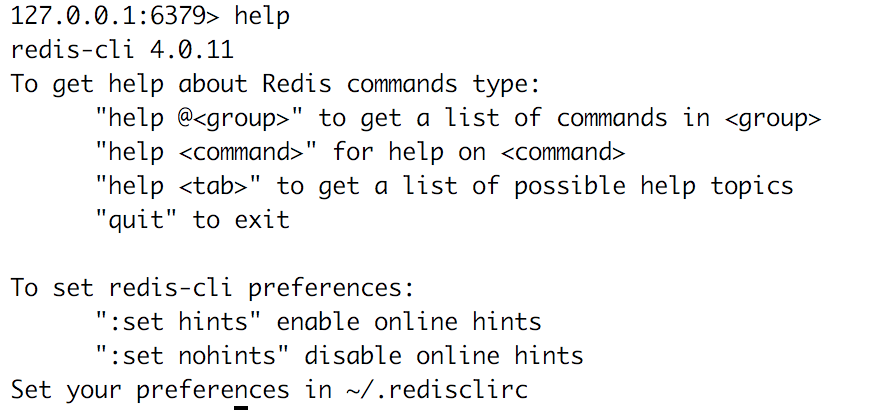
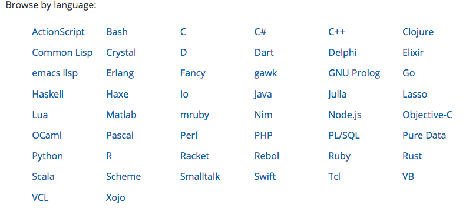

.. ========================================================
.. Redis: persistent collections as a service (and for fun)
.. ========================================================

Redis: persistent collections as a service (and for fun)
--------------------------------------------------------

A quick introduction to Redis, and why I really like it

By Tibs / Tony Ibbs

Presented at PyCon UK 2018

Written using reStructuredText_.

Converted to PDF slides using pandoc_ and beamer_.

Source and extended notes at https://github.com/tibs/redis-talk

.. _reStructuredText: http://docutils.sourceforge.net/docs/ref/rst/restructuredtext.html
.. _pandoc: https://pandoc.org
.. _beamer: https://github.com/josephwright/beamer

----

Summary of what I'd like to cover (not to be included in final slides)
----------------------------------------------------------------------

Broadly: what Redis is, and why it might be useful; the fact it has clients in
many programming languages, and a rather good CLI tool; what datatypes it
provides, and how they relate to Python concepts; that it is instruction
based; how to use the Redis documentation (which is where being instruction
based helps, as one documentation can serve all); how I wanted BRPOPLPUSH, and
was very pleased to discover that (a) it existed, (b) it was atomic, and (c)
that it gives back the data item that it is rotating [if that doesn't make
sense, then I'll be explaining it in the talk!] - this is part of my
assessment that the service is well designed; that several Python clients
exist, but we use redis-py, and how easy it is to use, and also to unit-test
with fakeredis (I consider it very important to show that unit testing is
possible and easy, because we're all used to the hassle of unit testing things
as seemingly simple as Requests).

----

So what is Redis?

-----

Well `its website`_ says:

    Redis is an open source (BSD licensed), in-memory data structure store,
    used as a database, cache and message broker. It supports data structures
    such as strings, hashes, lists, sets, sorted sets with range queries,
    bitmaps, hyperloglogs and geospatial indexes with radius queries. Redis
    has built-in replication, Lua scripting, LRU eviction, transactions and
    different levels of on-disk persistence, and provides high availability
    via Redis Sentinel and automatic partitioning with Redis Cluster.

    -- https://redis.io/

.. _`its website`: https://redis.io/

... and that's not even everything it does!

----

My interest in it is a lot lower-key, and mainly in its role as a key-value
store.

.. note:: Being a key-value store also puts it in the No-SQL "family"
   (although that's not particularly interesting to me).

------------------

I came across it through work, and became enthusiastic about it because:

* it presents an elegant design - it keeps letting me do what I want!
* it has good documentation
* it has excellent Python tooling
* it fill an interesting niche

------------------

My particular interest is in its use as a persistence mechanism for use with
Python.

------------------

Like the Tardis (!) this means that it can communicate data across time and
space:

* across time - a program can save data and re-acquire it later on, in a
  separate run of the process (or after a crash)
* across space - data can be shared across coroutines, threads, processes and
  processors

Also, as in the world of the Tardis, there is no problem of language (on Dr
Who everyone always appears to speak english). There are Redis clients for
many different programming languages, and an excellent command line client.

------------------

This does come at *some* compromise - there are only a limited number of
actual datastructures supported - but as we'll see the common Python
datastructures are well supported, as are some interesting other cases, and
there's always (for instance) JSON.

------------------

So, key-value store:

  <key> : <value>

------

Keys are what Redis refers to as *strings* - in Python we would call them
byte-strings.

The byte-string is actually the basic datatype in Redis.

Note that Redis does not address encodings - that has to be handled
out-of-band, which is (in context) reasonable enough.

----

So a Redis key is a byte string, of up to 512MB - although one is discouraged
from using keys that are too big.

.. note:: Interestingly, this *does* mean that one can do things like use a
  JSON datastructure as a key.

----

Traditionally, examples of Redis keys are given in the form
b"<namespace>:<name>" (although they tend to say <server> instead of
<namespace>).

----

So what can values be?

This is where it gets interesting:

* strings
* lists
* sets
* sorted sets
* hashes
* bit arrays
* hyperloglogs and geospatial values (and so on?)

----

Note: one level only - so a value cannot be a set of hashes.

A reasonable enough restriction. Go with (e.g.) JSON if it's not sufficient.

----

Several of those should be familiar to Python programmers.

NB: Probably sufficient to show the Python examples only, and not the
redis-cli equivalents.

NB: Probably want to talk about what the Python library I'm using does with
respect to being given a string instead of a byte string (but avoid this in
the examples by always using a byte string).

NB: Be prepared to explain why ``StrictRedis`` rather than ``Redis``.

NB: Have a list (just a summary) to hand of all the operations that can be
done on each value type, and on keys.

----

So, let's make a connection to a Redis server:

Command line:

.. code:: sh

  tonibb01@spoon ~/sw$ redis-cli
  127.0.0.1:6379>

or Python:

.. code:: python

  >>> import redis
  >>> r = redis.StrictRedis(host='localhost')

----

Strings

* binary strings
* can be (e.g.) JSON
* again, encoding is out-of-band information

----

.. code:: sh

  127.0.0.1:6379> set my:string 'some text'
  OK
  127.0.0.1:6379> get my:string
  "some text"

----

.. code:: python

  >>> r.set(b'my:string', b'some text')
  True
  >>> r.get(b'my:string')
  b'some text'

----

But also can treat as integers

(so b'10' represents 10)

Atomic incremenent/decrement

Usable as sempahores

----

.. code:: sh

  127.0.0.1:6379> set my:number 1
  OK
  127.0.0.1:6379> get my:number
  "1"
  127.0.0.1:6379> incr my:number
  (integer) 2
  127.0.0.1:6379> get my:number
  "2"

----

.. code:: python

  >>> r.set(b'my:number', 1)  # NB: 1 -> b'1'
  True
  >>> r.get(b'my:number')
  b'1'
  >>> r.incr(b'my:number')
  2
  >>> r.get(b'my:number')
  b'2'

----

Lists

Very much like Python lists, but also like deques.

Can access the last element with index -1.

----

.. code:: sh

  127.0.0.1:6379> lpush my:list 1 2 3
  (integer) 3
  127.0.0.1:6379> lrange my:list 0 -1
  1) "3"
  2) "2"
  3) "1"
  127.0.0.1:6379> rpop my:list
  "1"
  127.0.0.1:6379> lrange my:list 0 -1
  1) "3"
  2) "2"

----

.. code:: python

  >>> r.lpush(b'my:list', 1, 2, 3)
  3
  >>> r.lrange(b'my:list', 0, -1)
  [b'3', b'2', b'1']
  >>> r.rpop(b'my:list')
  b'1'
  >>> r.lrange(b'my:list', 0, -1)
  [b'3', b'2']

----

Sets

Again, very like Python sets

----

.. code:: sh

  127.0.0.1:6379> sadd my:set a b c
  (integer) 3
  127.0.0.1:6379> smembers my:set
  1) "a"
  2) "c"
  3) "b"

----

.. code:: python

  >>> r.sadd(b'my:set', 'a', 'b', 'c')
  3
  >>> r.smembers(b'my:set')
  {b'a', b'c', b'b'}

----

Sorted sets

Done by adding a *score* (a floatring point number) to each element.

Set is ordered by that score.

Altough scores do not *need* to be unique.

Can extract by value, by score, by range of scores (including positive and
negative infinity).

----

.. code:: sh

  127.0.0.1:6379> zadd my:zset 0 a
  (integer) 1
  127.0.0.1:6379> zadd my:zset 1 b
  (integer) 1
  127.0.0.1:6379> zrange my:zset 0 -1
  1) "a"
  2) "b"
  127.0.0.1:6379> zrange my:zset 1 -1 withscores
  1) "b"
  2) "1"

----

.. code:: python

  >>> r.zadd(b'my:zset', 0, 'a')
  1
  >>> r.zadd(b'my:zset', 1, 'b')
  1
  >>> r.zrange(b'my:zset', 0, -1)
  [b'a', b'b']
  >>> r.zrange(b'my:zset', 1, -1, withscores=True)
  [(b'b', 1.0)]

----

Hashes - just like Python dictionaries, although the hash keys (fields) and
values have to be binary strings.

NB: It's possible to increment and decrement hash values.

----

.. code:: sh

  27.0.0.1:6379> hset my:dict k1 val1
  (integer) 1
  127.0.0.1:6379> hset my:dict k2 val2
  (integer) 1
  127.0.0.1:6379> hget my:dict k2
  "val2"
  127.0.0.1:6379> hkeys my:dict
  1) "k1"
  2) "k2"
  127.0.0.1:6379> hgetall my:dict
  1) "k1"
  2) "val1"
  3) "k2"
  4) "val2"

----

.. code:: python

  >>> r.hset(b'my:dict', b'k1', b'val1')
  1
  >>> r.hset(b'my:dict', b'k2', b'val2')
  1
  >>> r.hget(b'my:dict', b'k2')
  b'val2'
  >>> r.hget(b'my:dict', b'k3')     # i.e., result is None
  >>>
  >>> r.hkeys(b'my:dict')
  [b'k1', b'k2']
  >>> r.hgetall(b'my:dict')
  {b'k1': b'val1', b'k2': b'val2'}

----

Note: it is possible to delete things whether they exist or not:

.. code:: python

  >>> r.delete(b'my:dict')
  1                               # It existed
  >>> r.exists(b'my:dict')
  False                           # It did not exist
  >>> r.delete(b'no:such:thing')
  0
  >>> r.exists(b'no:such:thing')
  False

----

Bit arrays: a nice specialisation of strings to give bitmaps, with useful
operations on them.

Geo-spatial items: items on a sphere representing the earth.

Hyperloglogs: if you know what they are, you probably like having them.

----

...at this point introduce the CLI?

.. image:: images/redis_cli_with_completion.png

NB: explain what the options on that command line mean

----

which as well as completion has nice help

----

.. image:: images/redis_cli_help_for_hashes.png

(obviously more not shown)

----

...and the online documentation?

----

Commands overview

.. image:: images/redis_webpage_commands_smaller.png

...

-----

Individual command documentation

.. image:: images/redis_webpage_command_append_smaller.png

...

-----

----

14 clients (of varying status and type) listed for Python

They say:

  redis-py Mature and supported. Currently the way to go for Python. 

https://github.com/andymccurdy/redis-py

and that's the library we've been using in the examples so far.

----

Testing

Because we use redis-py, we then use fakeredis for unit testing

https://github.com/jamesls/fakeredis

    fakeredis is a pure python implementation of the redis-py python client
    that simulates talking to a redis server. This was created for a single
    purpose: to write unittests.

----

.. code:: python

  def test_my_understanding_of_zadd():
      r = fakeredis.FakeStrictRedis(singleton=False)

      now_timestamp = datetime(2018, 4, 23, 0, 0, 0).now()

      r.zadd(b'timeout', now_timestamp, b'text')

      assert r.zrange(b'timeout', 0, -1, withscores=True) \
          == [(b'text', now_timestamp)]

----

For asyncio, I've been experimenting with aioredis

https://github.com/aio-libs/aioredis

which provides an API very like redis-py, but asyncio

----

For unit-testing *that*, I've found it simplest to just make a very simple
asyncio wrapper class around fakeredis.

This is the approach that mockaioredis_ takes with the mock-redis_ library
and (a) it's really not much work, and (b) it's very simple

(of course, aioredis itself just wraps redis-py!)

.. _mockaioredis: https://github.com/kblin/mockaioredis
.. _mock-redis: https://github.com/locationlabs/mockredis

And pytest-asyncio_ is very nice.

.. _pytest-asyncio: https://github.com/pytest-dev/pytest-asyncio

----

.. code:: python

    class JustEnoughAsyncRedis:

        def __init__(self, fake_redis=None, singleton=False):
            if fake_redis:
                self.redis = fake_redis
            else:
                self.redis = fakeredis.FakeStrictRedis(
                    singleton=singleton)

        async def brpoplpush(self, sourcekey, destkey,
                             timeout=0, encoding=_NOTSET):
            return self.redis.brpoplpush(sourcekey, destkey,
                                         timeout)

        # and so on (only *with* docstrings!)

----

Fin
---

Written using reStructuredText_.

Converted to PDF slides using pandoc_ and beamer_.

Source and extended notes at https://github.com/tibs/redis-talk

.. vim: set filetype=rst tabstop=8 softtabstop=2 shiftwidth=2 expandtab:
