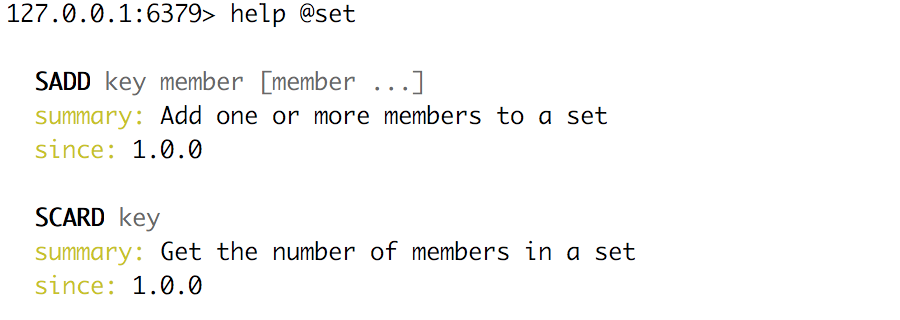
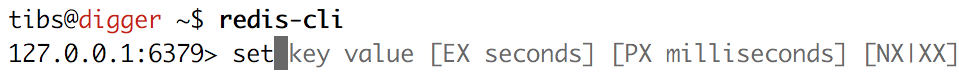

=====
Story
=====

So what is Redis?

-----

Well `its website`_ says:

    Redis is an open source (BSD licensed), in-memory data structure store,
    used as a database, cache and message broker. It supports data structures
    such as strings, hashes, lists, sets, sorted sets with range queries,
    bitmaps, hyperloglogs and geospatial indexes with radius queries. Redis
    has built-in replication, Lua scripting, LRU eviction, transactions and
    different levels of on-disk persistence, and provides high availability
    via Redis Sentinel and automatic partitioning with Redis Cluster.

    -- https://redis.io/

.. _`its website`: https://redis.io/

... and that's not even everything it does!

----

My interest in it is a lot lower-key, and mainly in its role as a key-value
store.

.. note:: Being a key-value store also puts it in the No-SQL "family"
   (although that's not particularly interesting to me).

------------------

I came across it through work, and became enthusiastic about it because:

* it presents an elegant design - it keeps letting me do what I want!
* it has good documentation
* it has excellent Python tooling
* it fill an interesting niche

------------------

My particular interest is in its use as a persistence mechanism for use with
Python.

------------------

Like the Tardis (!) this means that it can communicate data across time and
space:

* across time - a program can save data and re-acquire it later on, in a
  separate run of the process (or after a crash)
* across space - data can be shared across coroutines, threads, processes and
  processors

Also, as in the world of the Tardis, there is no problem of language (on Dr
Who everyone always appears to speak english). There are Redis clients for
many different programming languages, and an excellent command line client.

------------------

This does come at *some* compromise - there are only a limited number of
actual datastructures supported - but as we'll see the common Python
datastructures are well supported, as are some interesting other cases, and
there's always (for instance) JSON.

------------------

So, key-value store:

  <key> : <value>

------

Keys are what Redis refers to as *strings* - in Python we would call them
byte-strings.

The byte-string is actually the basic datatype in Redis.

Note that Redis does not address encodings - that has to be handled
out-of-band, which is (in context) reasonable enough.

----

So a Redis key is a byte string, of up to 512MB - although one is discouraged
from using keys that are too big.

.. note:: Interestingly, this *does* mean that one can do things like use a
  JSON datastructure as a key.

----

Traditionally, examples of Redis keys are given in the form
b"<namespace>:<name>" (although they tend to say <server> instead of
<namespace>).

----

So what can values be?

This is where it gets interesting:

  * binary-safe strings
  * lists (linked lists, so sorted by insertion order)
  * sets (unique, unsorted string elements)
  * sorted sets (every string is associated with a floating number value, its
    score. Score ranges can be used for retrieval of elements)
  * Hashes (dictionaries of fields -> values, both of which are strings)
  * Bit arrays (bitmaps) - stored as strings
  * Hyperloglogs (a probabalistic data structure, used in order to estimate a
    cardinality(!))

----

Note: one level only - so a value cannot be a set of hashes.

A reasonable enough restriction. Go with (e.g.) JSON if it's not sufficient.

----

Several of those should be familiar to Python programmers.

----

Strings

* binary strings
* can be (e.g.) JSON
* again, encoding is out-of-band information

----

But also can treat as integers

(so b'10' represents 10)

Atomic incremenent/decrement

Usable as sempahores

----

Lists

Very much like Python lists, but also like deques.

Can access the last element with index -1.

----

Sets

Again, very like Python sets

----

Sorted sets

Done by adding a *score* (an integer) to each element.

Set is ordered by that integer.

Can extract by value, by integer, by range of integers (including positive and
negative infinity).

----

Hashes - just like Python dictionaries, although the hash keys (fields) and
values have to be binary strings.

----

Bit arrays - a nice specialisation of strings to give bitmaps, with useful
operations on them.

----

Hyperloglogs

If you know what they are, you probably like having them.

----

...at this point introduce the CLI?

----

...and then give some Pyton code examples

----

...and talk about unit testing

----

...and briefly mention the asyncio story

-----

Pictures

-----

NB: explain what the options on that command line mean

----

.. image:: images/redis_cli_help_for_hashes.png

----

----

----

.. image:: images/redis_webpage_commands_smaller.png

-----

.. image:: images/redis_webpage_command_append_smaller.png

----

.. image:: images/redis_client_by_language.png

14 clients (of varying status and type) listed for Python

----

They say:

  redis-py Mature and supported. Currently the way to go for Python. 

https://github.com/andymccurdy/redis-py

----

It's easy to use:

.. code:: python

  >>> import redis
  >>> r = redis.StrictRedis(host='localhost')
  >>> r.set(b'tibs:pyconuk', b'SomeValue')
  True
  >>> r.get('tibs:pyconuk')
  b'SomeValue'

----

.. code:: python

  >>> r.hset('tibs:hash', 'key1', 'value1')
  1
  >>> r.hset('tibs:hash', 'key1', 'value2')
  0

----

It supports Redis well, and in a reasonably Pythonic manner, which is good.

----

Testing

Because we use redis-py, we then use fakeredis for unit testing

https://github.com/guilleiguaran/fakeredis

It is an "In-memory driver for redis-rb, useful for development and test
environments"

----

For asyncio, I've been experimenting with aioredis

https://github.com/aio-libs/aioredis

which provides an API very like redis-py, but asyncio

----

For unit-testing *that*, I've found it simplest to just make a very simple
asyncio wrapper class around fakeredis.

This is the approach that mockaioredis_ takes with the mock-redis_ library
and (a) it's really not much work, and (b) it's very simple

(of course, aioredis itself just wraps redis-py!)

.. _mockaioredis: https://github.com/kblin/mockaioredis
.. _mock-redis: https://github.com/locationlabs/mockredis

----

Pub/Sub (broadcast messaging) looks cool as well, and I want to play with it

.. code:: python

  >>> r = redis.StrictRedis(...)
  >>> p = r.pubsub()

  >>> r.publish('my-first-channel', 'some data')
  2
  >>> p.get_message()
  {'channel': 'my-first-channel', 'data': 'some data',
   'pattern': None, 'type': 'message'}

.. vim: set filetype=rst tabstop=8 softtabstop=2 shiftwidth=2 expandtab:
